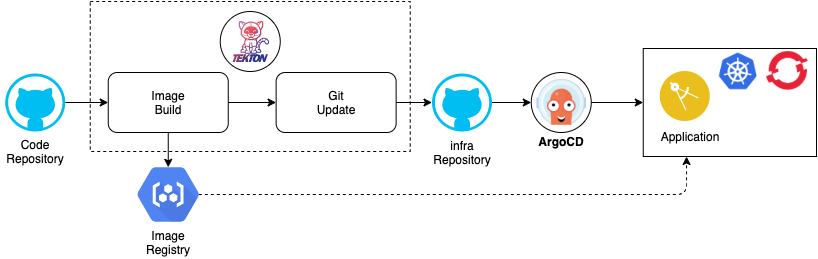

# Tutorial for Tekton and ArgoCD Integration

This tutorials shows the concept of seperation of concerns in DevOps.
The project is setup in 3 repos (not all teams will have write access to all of them)
- This git repo only contains the pipeline setup
  - https://github.com/csantanapr/tutorial-tekton-argocd-pipeline
- The git repo that contains only the application source code
  - https://github.com/csantanapr/tutorial-tekton-argocd-code
- The git repo that contains only the infrastructure manifests (yaml)
  - https://github.com/csantanapr/tutorial-tekton-argocd-infra

- We will be using Tekton to build the container image, and update the Infra Git repo.
- We will be using ArgoCD to deploy the application from the infra git repo



## Prereqs

- Install OpenShift Operators
  - Install OpenShift Pipeline Operator
    ```bash
    oc apply -f operators/tekton-operator.yaml
    ```
  - Install [ArgoCD (HELM) Operator](https://github.com/disposab1e/argocd-operator-helm) on the `argocd` namespace
    ```bash
    oc apply -f operators/argocd-operator.yaml
    ```
    When installing the tutorial, make sure you wait until the argocd-operator is finished before installing the argocd-cr..or it will fail. You can do this:
    ```bash
    oc get ClusterServiceVersion/argocd-operator-helm.v0.0.3 -n argocd
    NAME                          DISPLAY                   VERSION   REPLACES                      PHASE
    argocd-operator-helm.v0.0.3   Argo CD Operator (Helm)   0.0.3     argocd-operator-helm.v0.0.2   Succeeded
    ```
    and wait for the "succeeded" to come up before proceeding.
    ```bash
    oc apply -f operators/argocd-cr.yaml
    ```
- [Install Tekton CLI](https://github.com/tektoncd/cli#installing-tkn) `tkn`
- [Install ArgoCD CLI](https://argoproj.github.io/argo-cd/cli_installation/) `argocd`

## Git clone this repository
- Get a copy of the devops git repository and change directory
  ```bash
  git clone https://github.com/csantanapr/tutorial-tekton-argocd-pipeline
  cd tutorial-tekton-argocd-pipeline
  ```

## Setup target Namespace
- Create a new namespace/project
  ```bash
  oc new-project tekton-argocd
  ```
- Set the environment variable `NAMESPACE`
  ```bash
  export NAMESPACE=$(oc project -q)
  echo "NAMESPACE set to $NAMESPACE"
  ```

## Create ArgoCD Application

- Set an environment variable `ARGOCD_URL` using the `EXTERNAL-IP`
    ```bash
    export ARGOCD_NAMESPACE="argocd"
    export ARGOCD_SERVER=$(oc get route argocd-server -n $ARGOCD_NAMESPACE -o jsonpath='{.spec.host}')
    export ARGOCD_URL="https://$ARGOCD_SERVER"
    echo ARGOCD_URL=$ARGOCD_URL
    echo ARGOCD_SERVER=$ARGOCD_SERVER
    ```
- Login into the UI.
    ```bash
    open $ARGOCD_URL
    ```
- Use `admin` as the username and get the password with the following command, it's the name of the pod for the argo-server
    ```bash
    oc get pods -n $ARGOCD_NAMESPACE -l app.kubernetes.io/name=argocd-server -o name | cut -d'/' -f 2
    ```
    For example the output is similar to this:
    ```
    argocd-server-b54756f69-jncc9
    ```
    ```bash
    export ARGOCD_PASSWORD=$(oc get pods -n $ARGOCD_NAMESPACE -l app.kubernetes.io/name=argocd-server -o name | cut -d'/' -f 2)
    ```

- Login into ArgoCD
  ```bash
  argocd login --username admin --password $ARGOCD_PASSWORD $ARGOCD_SERVER
  ```

- Create the App
  ```bash
  export ARGOCD_APP=$(oc project -q)
  export GIT_REPOSITORY_URL="https://github.com/csantanapr/tutorial-tekton-argocd-infra"
  export GIT_MANIFEST_DIR="yamls/ocp"
  ```
  ```bash
  argocd app create $ARGOCD_APP \
  --project default \
  --repo $GIT_REPOSITORY_URL \
  --path $GIT_MANIFEST_DIR \
  --dest-server https://kubernetes.default.svc \
  --dest-namespace $NAMESPACE \
  --sync-policy automated \
  --self-heal \
  --auto-prune
  ```

  ```
  application 'tekton-argocd' created
  ```

## Build Image with Tekton


- Deploy the pipeline assets
  ```bash
  oc apply -f pipeline/ -n $NAMESPACE
  ```

  ```bash
  tkn resources ls -n $NAMESPACE
  ```
  ```
  NAME     TYPE    DETAILS
  source   git     url: https://github.com/csantanapr/tutorial-tekton-argocd-code
  image    image   url: image-registry.openshift-image-registry.svc:5000/$NAMESPACE/app
  ```

  ```bash
  tkn task ls -n $NAMESPACE
  ```
  ```
  NAME        AGE
  build       36 seconds ago
  build-git   36 seconds ago
  ```

  ```bash
  tkn pipeline ls -n $NAMESPACE
  ```
  ```
  NAME        AGE              LAST RUN   STARTED   DURATION   STATUS
  build-git   17 seconds ago   ---        ---       ---        ---
  ```

- Run the build task to test image build only
  ```bash
  tkn task start build \
    -i image=image \
    -i source=source \
    --showlog \
    -s pipeline \
    -n $NAMESPACE
  ```

  ```bash
  tkn taskrun ls -n $NAMESPACE
  ```
  ```
  NAME              STARTED         DURATION    STATUS
  build-run-c4d4r   4 minutes ago   2 minutes   Succeeded
  ```

  ```bash
  oc get imagestream -n $NAMESPACE
  ```
  ```
  NAME   IMAGE REPOSITORY                                                     TAGS      UPDATED
  app    image-registry.openshift-image-registry.svc:5000/tekton-argocd/app   b711ac7   About a minute ago
  ```

## Update Infrastructure Git repo

### Configure Github Personal Access Token

- For your CI pipeline to connect to and use your GitHub repo, it will need a [GitHub personal access token](https://help.github.com/en/github/authenticating-to-github/creating-a-personal-access-token-for-the-command-line) with `public_repo` and `write:repo_hook` scopes.
- Navigate to [Developer Settings](https://github.com/settings/tokens) and generate a new token; name it something like "CI pipeline"
- Select `public_repo` scope to enable git clone
- Select `write:repo_hook` scope so the pipeline can create a web hook
- The GitHub UI will never again let you see this token, so be sure to **save the token** in your password manager or somewhere safe that you can access later on
- Create the secret for the Infra repository, replace `<GIT_USERNAME>` and `<GIT_TOKEN>`, keep the quotes
    ```bash
    export GIT_USERNAME='<GIT_USERNAME>'
    export GIT_TOKEN='<GIT_TOKEN>'
    ```
    ```bash
    oc create secret generic git-infra-secret \
      --from-literal=username="$GIT_USERNAME" \
      --from-literal=token="$GIT_TOKEN" \
      -n $NAMESPACE
    ```

- Run Pipeline to Build Image and Update Infra Git repo
  ```bash
  tkn pipeline start build-git \
              --showlog \
              -r source=source \
              -r image=image \
              -s pipeline \
              -n $NAMESPACE
  ```

  ```bash
  tkn pipeline ls -n $NAMESPACE
  ```
  ```
  NAME        AGE             LAST RUN              STARTED         DURATION   STATUS
  build-git   2 minutes ago   build-git-run-rdhmj   2 minutes ago   1 minute   Succeeded
  ```

## Extra Credit: Create Git Webhook

- This is only possible if your OpenShift cluster is accessible from the the github server (ie github.com)
- Create a WebHook for the Code Git repo
  ```bash
  oc apply -f triggers/ -n $NAMESPACE
  ```

  ```bash
  oc create route edge --service=el-cicd -n $NAMESPACE
  ```

  ```bash
  export GIT_WEBHOOK_URL=$(oc get route el-cicd -o jsonpath='{.spec.host}' -n $NAMESPACE)
  echo "https://$GIT_WEBHOOK_URL"
  ```

- Set the `GIT_REPO_NAME` to name of the Code Git repo like `tutorial-tekton-argocd-code`
  ```bash
  export GIT_REPO_NAME='<GIT_REPO_NAME>'
  ```

- Set the `GIT_REPO_OWNER` to name of the Code Git repo like `csantanapr`
  ```bash
  export GIT_REPO_OWNER='<GIT_REPO_OWNER>'
  ```

- Run curl to create the web hook
  ```bash
  curl -v -X POST -u $GIT_USERNAME:$GIT_TOKEN \
  -d "{\"name\": \"web\",\"active\": true,\"events\": [\"push\"],\"config\": {\"url\": \"https://$GIT_WEBHOOK_URL\",\"content_type\": \"json\",\"insecure_ssl\": \"0\"}}" \
  -L https://api.github.com/repos/$GIT_REPO_OWNER/$GIT_REPO_NAME/hooks
  ```

Make a change on the Code repository, and verify that Github sent the WebHook to the event listener, and that the Pipeline runs in OpenShift Console
